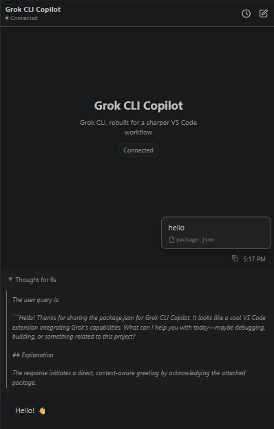
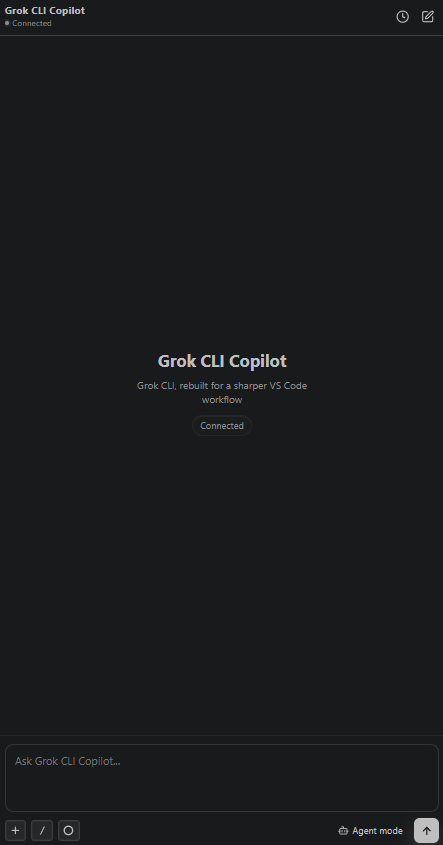

# Grok CLI Copilot

[](https://marketplace.visualstudio.com/items?itemName=jacobthejacobs.grok-cli-copilot)
[](https://marketplace.visualstudio.com/items?itemName=jacobthejacobs.grok-cli-copilot)
[](https://github.com/JacobTheJacobs/vscode-supergrok)


[](LICENSE)

> **Not an official xAI product.** Independent, community-built, and held together by
> TypeScript and reasonable intentions. It drives your **local Grok CLI** over stdio.
> Not affiliated with, endorsed by, or published by xAI — there is no official Grok
> extension from xAI for VS Code, which is roughly why this one exists. "Grok" is a
> trademark of xAI, borrowed here only to describe what this talks to.

A focused VS Code sidebar that puts the local Grok CLI where you already live —
next to your code, instead of in yet another browser tab.

[](https://marketplace.visualstudio.com/items?itemName=jacobthejacobs.grok-cli-copilot)

[](https://marketplace.visualstudio.com/items?itemName=jacobthejacobs.grok-cli-copilot)

## Requirements

- The **Grok CLI**, installed and signed in (it does the actual thinking)

## Setup — log in to the Grok CLI first

This extension is a friendly face for the Grok CLI. No CLI, no face. Install and
sign in **before** opening the sidebar, otherwise it sits there loading models
with the patience of a saint and the results of a brick.

1. Install the Grok CLI:
   - Windows (PowerShell): `irm https://x.ai/cli/install.ps1 | iex`
   - macOS / Linux: `curl -fsSL https://x.ai/cli/install.sh | bash`
2. Log in (opens a browser):

   ```bash
   grok login
   ```
3. Open VS Code → the **Super Grok** sidebar and start grokking. (If the CLI isn't
   on your `PATH`, point `grok.cliPath` at it in Settings.)

## Install

- Marketplace: [open the listing](https://marketplace.visualstudio.com/items?itemName=jacobthejacobs.grok-cli-copilot)
- VSIX, for the impatient:

  ```bash
  npm run package
  code --install-extension grok-cli-copilot-*.vsix
  ```

## Features

- chat with the local Grok CLI without leaving your editor
- session history and quick switching, because you will lose track
- slash commands (with search) and effort control — dial the reasoning up or down
- file/folder context, `@` mentions, and image paste
- inline generated media, thinking blocks, and permission cards (it asks before it touches anything)

## Settings

- `grok.cliPath` — where the CLI lives, for when auto-detect gives up
- `grok.defaultModel`
- `grok.defaultEffort`
- `grok.includeActiveFileByDefault`
- `grok.useCtrlEnterToSend`

## License

MIT
